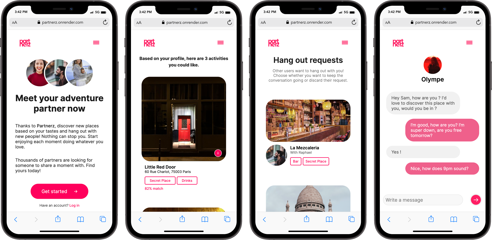

# PARTNERZ - project 2 at Iron Hack

We worked on our second project for 4 days in a group of 3: Sam Sinz, Olympe Lespagnon and Justine Sarzi. We succeeded to deliver even if we wished to have more time to implement more features. We are really proud of this project because what started as a school project turned into a potential business idea.

Partnerz is made for Mobile - we hope to turn it into an app, as there is no desktop version yet.

Partnerz is not a dating/meeting app! it is more than that. Users have to choose 2 to 5 tags (ex: 'Drinks', 'Original'..) and are shown different choices of activities depending on their tastes. Then, they select the activity they would like to do and find an partner. They have the possibility to send them a request to go to the place together. The other user will receive an invitation and have the possibility to decline or accept the request. 
To finish they can both discuss to decide when and where to meet to fully live the Partnerz experience!

## DEMO MOBILE VERSION

## [Link to the APP](https://partnerz.onrender.com)

## About the implementation

We used the following:

- 5 connected models: User / Activity / Match / Message / Discussion
- Creation of an account 
- The user can edit their profile and save it on our database (profile picture, bio and tags)
- Matching between a user and an activity (depending on the number of tags they have in common) 
- Sending a request
- Accepting or declining an invitation
- Starting a conversation
- Having access to all of their requests
- A database on Mongoose Atlas 
- Deployment on Render 

## Possible improvements

- Deploying not only on a mobile version but also as an App.
- Receiving a notification every time the user gets a request and message.
- Adding real-time messages with timestamps.
- Increasing our database.
- Make Partnerz a real bussiness.

